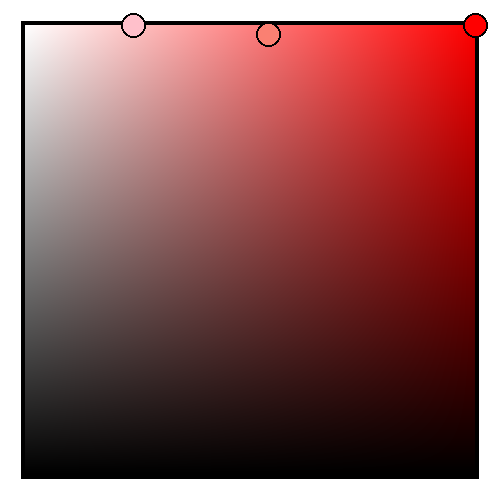
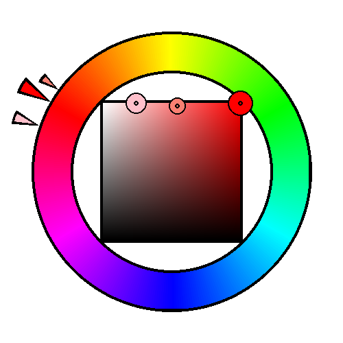
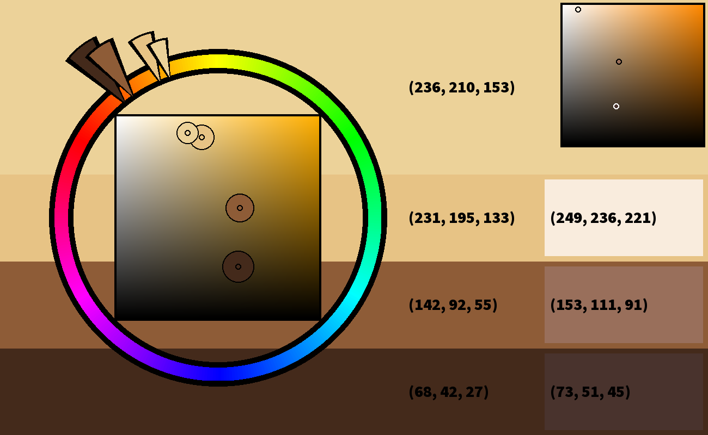

# PythonArtRgb

Color library that handles common art program blend modes as well as color wheel and saturation-value box visualizations.

Installation only through source at the moment. Will try to release to Pypi when i have some time.
```
pip install git+https://github.com/stuartsartcode/PythonArtRgb
```

## Color visualization classes

| Color Wheel: | Color Box | Color Wheel Box:
| --- | --- | --- |
| |  | 
| Arrows are added corresponding to the Hue. Note the (overridable) -150 degree offset to match CSP. | Dots are placed corresponding to saturation (Y) and value (X) | Combination Wheel/Box
| [source](src/artrgb/color_wheel.py) - [example](examples/example_colorwheel.py) | [source](src/artrgb/color_box.py) - [example](examples/example_colorbox.py) | [source](src/artrgb/color_wheel_box.py) - [example](examples/example_colorwheelbox.py)


| Sample Image| Example Swatch analyzing skintone|
| --- | --- |
 | 

## RGB class
Features:
- treated as a normal tupple by other image libraries
- CSP styled hue, saturation, and value
- Normalized HST
- blend modes

```python
red = Rgb("red") # (255,0,0)

PIL.Image.new("RGB", (100,100), color = black)
red[0] # 255
red[1] # 0
red[2] # 0
len(red) # 3
red.rgb # (255,0,0)
red.hsv # (0,1,255)
red.hue # 0
red.saturation # 100
red.value # 100
```

Supported construction
```python
Rgb()           # Defaults to black
Rgb(0,0,0)
Rgb((0,0,0))    # Supports tupple input
Rgb(0,0,0,0)    # Drops alpha channel for RGBA input
Rgb((0,0,0,0))
Rgb("black")    # uses PIL.ImageColor to handle named colors
```

### Color blend modes:
```python
black = Rgb("black")
white = Rgb("white")
black + white
black - white
black * white
black / white
black.invert()
black.invert(white)
black.screen(white)
black.color_dodge(white)
black.linear_dodge(white)
black.hard_light(white)
black.overlay(white)
black.soft_light(white)
black.inv_soft_light(white)
```

### HSV access
```python
black = Rgb("black")
black.rgb           # (0-255, 0-255, 0-255)
black.hsv           # (0-1, 0-1, 0-255)
black.hue           # 0-360
black.saturation    # 0-100
black.value         # 0-100
```
